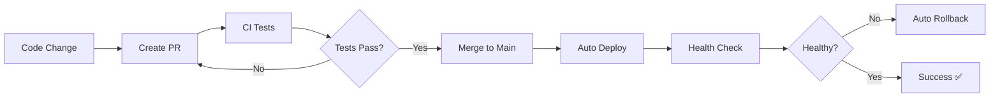

# 🚀 Nuzantara Deployment - Quick Reference

One-page quick reference for common deployment tasks.

## 🎯 Prerequisites Checklist

```bash
# Verify tools are installed
docker --version
node --version
flyctl version
git --version

# Login to Fly.io
flyctl auth login
```

## ⚡ Quick Commands

### Local Development

```bash
# Start all services
./scripts/deployment/deploy-local.sh

# Or manually
docker-compose up -d

# Check health
curl http://localhost:8080/health | jq .

# View logs
docker-compose logs -f backend

# Stop services
docker-compose down
```

### Deployment

```bash
# Validate before deploy
./scripts/deployment/validate-deployment.sh

# Backend (Fly.io)
cd apps/backend-rag && flyctl deploy

# Frontend (Vercel)
cd apps/mouth && vercel deploy --prod
```

### Health Checks

```bash
# Run full health check
./scripts/deployment/health-check.sh

# Quick checks
curl https://nuzantara-rag.fly.dev/health | jq .
curl -I https://www.balizero.com
```

### Rollback

```bash
# Interactive rollback (backend only)
./scripts/deployment/rollback.sh

# Backend rollback (Fly.io)
flyctl releases rollback --app nuzantara-rag -y

# Frontend rollback (Vercel) - use Vercel dashboard
```

## 📊 Monitoring

```bash
# View backend logs (Fly.io)
flyctl logs --app nuzantara-rag

# SSH into backend container
flyctl ssh console --app nuzantara-rag

# View backend metrics
flyctl metrics --app nuzantara-rag

# Check backend status
flyctl status --app nuzantara-rag

# Frontend monitoring - use Vercel dashboard
# https://vercel.com/dashboard
```

## 🔧 Common Fixes

### Restart Service
```bash
flyctl apps restart nuzantara-rag
```

### Update Secrets
```bash
flyctl secrets set KEY=value --app nuzantara-rag
```

### Scale Resources
```bash
# Scale memory
flyctl scale memory 2048 --app nuzantara-rag

# Scale VM count
flyctl scale count 2 --app nuzantara-rag
```

### View Configuration
```bash
flyctl config show --app nuzantara-rag
```

## 📁 File Structure

```
nuzantara/
├── .github/workflows/
│   ├── ci.yml              # Continuous Integration
│   └── monitoring.yml      # Health monitoring
├── apps/
│   ├── backend-rag/
│   │   ├── Dockerfile
│   │   └── fly.toml        # Backend Fly.io config
│   └── mouth/
│       ├── Dockerfile
│       └── vercel.json     # Frontend Vercel config
├── scripts/deployment/
│   ├── validate-deployment.sh
│   ├── health-check.sh
│   ├── rollback.sh
│   └── deploy-local.sh
└── docs/
    └── DEPLOYMENT.md       # Full documentation
```

## 🔐 Required Secrets

Set in GitHub: Settings → Secrets → Actions

```
FLY_API_TOKEN
OPENAI_API_KEY
ANTHROPIC_API_KEY
GOOGLE_API_KEY
DATABASE_URL
REDIS_URL
JWT_SECRET
NEXT_PUBLIC_API_URL
```

## 🆘 Emergency Procedures

### Service Down
```bash
# 1. Check status
flyctl status --app nuzantara-rag

# 2. View recent logs
flyctl logs --app nuzantara-rag -n 500

# 3. Restart
flyctl apps restart nuzantara-rag

# 4. If still down, rollback
flyctl releases rollback --app nuzantara-rag -y
```

### High Latency
```bash
# Scale up resources
flyctl scale memory 2048 --app nuzantara-rag
flyctl scale count 2 --app nuzantara-rag
```

### Database Issues
```bash
# Check DATABASE_URL
flyctl secrets list --app nuzantara-rag

# Update if needed
flyctl secrets set DATABASE_URL="new-url" --app nuzantara-rag
```

## 📞 Support

- **Documentation**: [docs/DEPLOYMENT.md](docs/DEPLOYMENT.md)
- **Fly.io Docs**: https://fly.io/docs/
- **GitHub Actions**: https://github.com/YOUR_ORG/nuzantara/actions

## 🎯 Deployment Workflow



---

**Keep this file handy for quick reference during deployments!**
